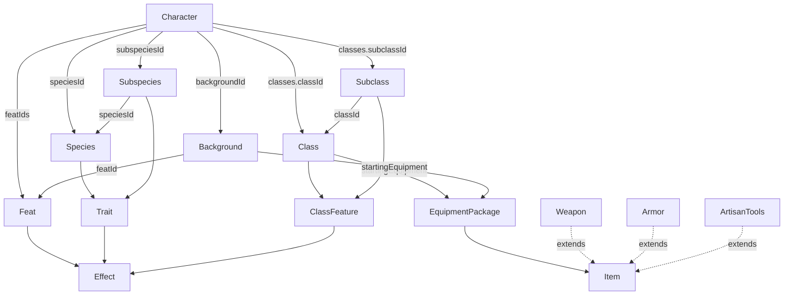

# Domain model

This is the reference for the type model in [`src/types/`](../src/types) — the
declarative data vocabulary the whole app is built on. Everything here is plain
data: interfaces and string-literal unions, no behaviour.

## Design principles

1. **Content vs. character.** *Content* types (`Class`, `Species`, `Feat`, …)
   are reusable definitions. A `Character` is a single created player-character
   that **references content by id** — it never embeds the definitions.
2. **References are ids.** A `Subclass` names its parent `Class` by `classId`, a
   `Subspecies` its `Species` by `speciesId`, a `Background` its origin feat by
   `featId`, and a `Character` names all of its content by id.
3. **Choices are `Choice<T>`.** Anything the player picks during creation
   ("choose 2 skills", "starting equipment A or B") uses one generic shape, so a
   single UI can render any decision.
4. **Effects are a shared union.** Mechanical benefits are described by a
   discriminated `Effect` union carried by `Feat`, `Trait` and `ClassFeature`.
   The `description` is for humans; `effects` is what the app acts on.
5. **Nothing derived is stored.** Ability modifiers, proficiency bonus, AC, HP
   and the like are computed from a character plus its content. (That
   derivation layer is not built yet — see [Not yet modelled](#not-yet-modelled).)

## Shared primitives — [`common/`](../src/types/common)

```ts
Choice<T>    // { choose: number; from: T[] }  — "choose N from a list"
Ability      // 'str' | 'dex' | 'con' | 'int' | 'wis' | 'cha'
Size         // 'small' | 'medium' | 'large'
Die          // 'd4' | 'd6' | 'd8' | 'd10' | 'd12' | 'd20' | 'd100'
DamageType   // 'acid' | 'bludgeoning' | … | 'thunder'  (13 types)
Skill        // 'acrobatics' | 'animal-handling' | … | 'survival'  (18 skills)
```

## Character instance — [`character/`](../src/types/character)

The thing being created. All content is referenced by id; the `classes` array is
what models multiclassing.

```ts
interface CharacterClass {
  classId: string;
  subclassId?: string;
  level: number;
}

interface Character {
  id: string;
  name: string;
  speciesId: string;
  subspeciesId?: string;
  backgroundId: string;
  classes: CharacterClass[];            // one entry per class → multiclassing
  abilityScores: Record<Ability, number>;
  skillProficiencies: Skill[];          // the skills actually chosen
  featIds: string[];
}
```

## Content entities

### Class, Subclass & feature — [`class/`](../src/types/class)

```ts
interface Class {
  id: string;
  name: string;
  description: string;
  hitDie: Die;
  primaryAbility: Ability[];
  savingThrowProficiencies: Ability[];  // fixed (e.g. Fighter = str + con)
  skillProficiencies: Choice<Skill>;    // a pick: { choose: 2, from: [...] }
  weaponProficiencies: Weapon['name'][];
  toolProficiencies: ArtisanTools['name'][];
  armorProficiencies: Armor['name'][];
  startingEquipment: Choice<EquipmentPackage>;  // pick one package (A/B)
  features: ClassFeature[];
}

interface Subclass {
  id: string;
  classId: string;                      // → Class
  name: string;
  description: string;
  features: ClassFeature[];
}

interface ClassFeature {
  id: string;
  name: string;
  description: string;
  level: number;                        // level at which it is gained (1–20)
  effects: Effect[];
}
```

"What does this class have at level N?" is `features.filter(f => f.level <= N)`;
subclass features fold in the same way.

### Species, Subspecies & trait — [`species/`](../src/types/species)

```ts
interface Species {
  id: string;
  name: string;
  description: string;
  creatureType: 'aberration' | 'beast' | … | 'undead';  // inline union
  size: Size;
  speed: number;                        // walking speed in feet
  traits: Trait[];
}

interface Subspecies {
  id: string;
  speciesId: string;                    // → Species
  name: string;
  traits: Trait[];
}

interface Trait {
  id: string;
  name: string;
  description: string;
  effects: Effect[];
}
```

### Background — [`background.ts`](../src/types/background.ts)

```ts
interface Background {
  id: string;
  name: string;
  description: string;
  abilityScores: Ability[];             // the abilities offered (allocate +2/+1 or +1/+1/+1)
  featId: string;                       // → the origin Feat granted
  skillProficiencies: Skill[];          // fixed for a background
  toolProficiency: ArtisanTools['name'] | 'None';
  startingEquipment: Choice<EquipmentPackage>;
}
```

### Feat — [`feat.ts`](../src/types/feat.ts)

```ts
interface Feat {
  id: string;
  name: string;
  description: string;
  category: 'origin' | 'general' | 'fighting-style' | 'epic-boon';
  prerequisite?: string;                // human-readable, not yet machine-checked
  effects: Effect[];
}
```

### Effect — [`effect/`](../src/types/effect)

A discriminated union of machine-readable benefits. Feats, traits and class
features all carry `effects: Effect[]`; apply them with a `switch (effect.kind)`.
Widen the union as new kinds are needed.

```ts
type Effect =
  | { kind: 'abilityScoreIncrease'; ability: Ability; amount: number }
  | { kind: 'grantSpells'; spellIds: string[]; castingAbility: Ability }
  | { kind: 'grantAbility'; name: string; description: string; activation: Activation; uses?: Uses }
  | { kind: 'grantProficiency'; skill: Skill }
  | { kind: 'attackRollBonus'; amount: number; attackType: AttackType };
```

`grantAbility` covers anything the character can *do*. Rather than a separate
kind per action type, the timing is a field — `Activation` — so that `trigger` is
required exactly when the ability is a Reaction and impossible otherwise:

```ts
type Activation =
  | { type: 'action' }
  | { type: 'bonus-action' }
  | { type: 'reaction'; trigger: string }
  | { type: 'free' }        // activated, but costs no action (Action Surge)
  | { type: 'passive' };    // always on, never activated
```

`Uses` is the resource side — how many times, and what restores it. `recharge` is
a *list* because a single rule can't describe Second Wind, which regains one use
on a Short Rest and all of them on a Long Rest:

```ts
interface RechargeRule { on: 'short-rest' | 'long-rest' | 'turn'; amount: number | 'all'; }
interface Uses { count: number; recharge: RechargeRule[]; }
```

### Items — [`item/`](../src/types/item)

`Item` is the base (cost + weight); `Weapon`, `Armor` and `ArtisanTools` extend
it. An `EquipmentPackage` is a bundle used as the `T` in a
`Choice<EquipmentPackage>` starting-equipment decision.

```ts
type CoinUnit = 'cp' | 'sp' | 'ep' | 'gp' | 'pp';
interface Cost { amount: number; unit: CoinUnit; }

interface Item {
  id: string;
  name: string;
  cost: Cost;
  weight: number;                       // pounds
}

interface EquipmentPackage {
  label: string;                        // "A" / "B" — display handle
  items: Item[];
  gold: number;
}

interface Damage { count: number; die: Die; type: DamageType; }  // e.g. 1d8 slashing

interface Weapon extends Item {
  category: WeaponCategory;             // 'simple' | 'martial'
  attackType: 'melee' | 'ranged';
  damage: Damage;
  properties: WeaponProperty[];         // 'finesse' | 'thrown' | 'versatile' | …
  mastery: WeaponMastery;               // 'cleave' | 'nick' | 'vex' | …
  range?: { normal: number; long: number };  // ranged/thrown weapons
}

interface ArtisanTools extends Item {
  ability: Ability;                     // added to checks made with the tools
}

interface Armor extends Item {
  armorClass: number;                   // base AC before Dex
  armorType: 'light' | 'medium' | 'heavy';
  maxDexBonus: number | null;           // null = no cap (light), 2 = medium, 0 = heavy
  strengthRequirement?: number;         // heavy armor
  stealthDisadvantage: boolean;
}
```

## Relationships



## Importing

Types live under `src/types/`, **one type per file**. Related types are grouped
into folders — `common/`, `character/`, `item/`, `class/`, `species/`, `effect/` —
each with a barrel `index.ts`; the single-type entities (`background.ts`,
`feat.ts`) sit at the top level. `src/types/index.ts` re-exports the commonly
used types:

```ts
import type { Character, Feat, Effect, Choice } from '../types';
import type { Class, Subclass } from '../types/class';
import type { Species, Trait } from '../types/species';
import type { Weapon, Armor } from '../types/item';
```

Import from a folder barrel rather than reaching into its files, so
`../types/item` — not `../types/item/weapon`. Within a folder, files import their
siblings directly (`./weapon-category`) and cross folders via the other barrel
(`../common`).

> The top-level barrel currently surfaces a curated subset; the folder types are
> imported from their folder barrels. Reconciling the top-level barrel to
> re-export everything is a possible cleanup.

## Not yet modelled

Known gaps, roughly in priority order for making the app a functional creator:

- **Real content data** — there are no instances yet (no Fighter, no Elf). A
  `src/data/` vertical slice is the next practical step.
- **Derivation layer** — a `derive(character, content)` that computes the sheet
  (ability modifiers, proficiency bonus, AC, HP, saves, skill bonuses). Needs a
  `Skill → Ability` map to compute skill modifiers.
- **Spells & spellcasting** — no `Spell` type yet; `Effect.grantSpells`
  references spell ids that don't resolve to anything.
- **Languages** and **conditions** — no types yet.
- **Character detail** — ability-score *bonuses* (the background +2/+1
  allocation), hit points, and inventory/equipped items are not on `Character`.
- **The creator UI** — the React app is still the scaffold.

### Small fixes

- `Species.creatureType` still has the misspelling `'abberation'` in the source
  (should be `'aberration'`); it's shown corrected above.
- `Feat.prerequisite` is free text and can't be checked; structured
  prerequisites would let the creator gate feats automatically.
