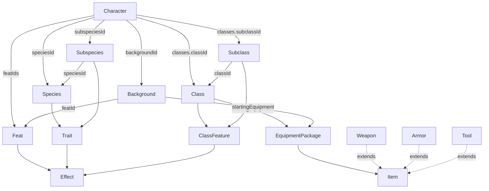

# Domain model

This is the reference for the type model in [`src/types/`](../src/types) — the
declarative data vocabulary the whole app is built on. Everything here is plain
data: interfaces and string-literal unions, no behaviour.

## Design principles

1. **Content vs. character.** *Content* types (`Class`, `Species`, `Feat`, …)
   are reusable definitions. A `Character` is a single created player-character
   that **references content by id** — it never embeds the definitions.
2. **References are ids.** A `Subclass` names its parent `Class` by `classId`, a
   `Subspecies` its `Species` by `speciesId`, a `Background` its origin feat by
   `featId`, and a `Character` names all of its content by id.
3. **Choices are `Choice<T>`.** Anything the player picks during creation
   ("choose 2 skills", "starting equipment A or B") uses one generic shape, so a
   single UI can render any decision.
4. **Effects are a shared union.** Mechanical benefits are described by a
   discriminated `Effect` union carried by `Feat`, `Trait` and `ClassFeature`.
   The `description` is for humans; `effects` is what the app acts on.
5. **Nothing derived is stored.** Ability modifiers, proficiency bonus, AC, HP
   and the like are computed from a character plus its content by
   [`src/lib/derive.ts`](../src/lib/derive.ts).

## Shared primitives — [`common/`](../src/types/common)

```ts
Choice<T>    // { choose: number; from: T[] }  — "choose N from a list"
Ability      // 'str' | 'dex' | 'con' | 'int' | 'wis' | 'cha'
Size         // 'small' | 'medium' | 'large'
Die          // 'd4' | 'd6' | 'd8' | 'd10' | 'd12' | 'd20' | 'd100'
DamageType   // 'acid' | 'bludgeoning' | … | 'thunder'  (13 types)
Skill        // 'acrobatics' | 'animal-handling' | … | 'survival'  (18 skills)
LevelScaled  // { steps: { at; value }[] }  — a number that grows with class level
```

## Character instance — [`character/`](../src/types/character)

The thing being created. All content is referenced by id; the `classes` array is
what models multiclassing.

```ts
interface CharacterClass {
  classId: string;
  subclassId?: string;
  level: number;
}

interface Character {
  id: string;
  name: string;
  speciesId: string;
  subspeciesId?: string;
  backgroundId: string;
  classes: CharacterClass[];            // one entry per class → multiclassing
  abilityScores: Record<Ability, number>;
  abilityScoreIncreases?: Partial<Record<Ability, number>>;  // chosen bonuses (ASI); folded by derive
  skillProficiencies: Skill[];          // the skills actually chosen
  featIds: string[];
  weaponIds: string[];                  // → Weapon, the weapons carried
  spellbook: Spellbook;                 // known spells + the chosen casting ability
  hiddenFeatureIds?: string[];          // feature cards the player chose to hide
  hiddenTraitIds?: string[];            // trait cards the player chose to hide
}

interface Spellbook {
  castingAbility?: Ability;             // chosen when a spell source is selected (e.g. an Elf lineage)
  knownSpellIds: string[];              // → Spell, the spells the character knows
}
```

The `spellbook` holds the character's spells as instance data: the ids it knows
and the one ability it casts them with. `derive` resolves the ids against the
`Spell` content and computes the save DC and attack bonus from the casting
ability. It is empty (`{ knownSpellIds: [] }`) for non-casters.

## Content entities

### Class, Subclass & feature — [`class/`](../src/types/class)

```ts
interface Class {
  id: string;
  name: string;
  description: string;
  hitDie: Die;
  primaryAbility: Ability[];
  savingThrowProficiencies: Ability[];  // fixed (e.g. Fighter = str + con)
  skillProficiencies: Choice<Skill>;    // a pick: { choose: 2, from: [...] }
  weaponProficiencies: Weapon['name'][];
  toolProficiencies: Tool['name'][];
  armorProficiencies: Armor['name'][];
  startingEquipment: Choice<EquipmentPackage>;  // pick one package (A/B)
  features: ClassFeature[];
}

interface Subclass {
  id: string;
  classId: string;                      // → Class
  name: string;
  description: string;
  features: ClassFeature[];
}

interface ClassFeature {
  id: string;
  name: string;
  description: string;
  level: number;                        // level at which it is gained (1–20)
  effects: Effect[];
}
```

"What does this class have at level N?" is `features.filter(f => f.level <= N)`;
subclass features fold in the same way. Every taken feature is listed on the
derived sheet, even when its effects also surface elsewhere: a `grantAbility`
feature also appears under Actions, a `grantFeat` feature sits alongside the
chosen feat in the Feats section (whose effects are already folded in — e.g.
Archery's bonus into the attack), and a `grantSubclass` feature alongside the
chosen subclass's own features (folded in by `subclassId`). The sheet never
decides to drop a card; instead each derived feature and trait carries a
`hidden` flag driven by `Character.hiddenFeatureIds` / `hiddenTraitIds`, so the
player chooses which cards to tuck away. The Ability Score Improvement feat is
the one thing still omitted automatically — it carries only an
`abilityScoreChoice`, so its increase folds into the ability totals and it is
left off the Feats section rather than listed as a card.

A feature with a `replaceFeature` effect supersedes the feature it names: once both
are gained the older one drops out of the derivation entirely, so an upgrade like
the Champion's Superior Critical shows in place of Improved Critical rather than
alongside it. This is not hiding — the character no longer has the replaced
feature at all.

### Species, Subspecies & trait — [`species/`](../src/types/species)

```ts
interface Species {
  id: string;
  name: string;
  description: string;
  creatureType: 'aberration' | 'beast' | … | 'undead';  // inline union
  size: Size;
  speed: number;                        // walking speed in feet
  traits: Trait[];
}

interface Subspecies {
  id: string;
  speciesId: string;                    // → Species
  name: string;
  traits: Trait[];
}

interface Trait {
  id: string;
  name: string;
  description: string;
  effects: Effect[];
}
```

### Background — [`background.ts`](../src/types/background.ts)

```ts
interface Background {
  id: string;
  name: string;
  description: string;
  abilityScores: Ability[];             // the abilities offered (allocate +2/+1 or +1/+1/+1)
  featId: string;                       // → the origin Feat granted
  skillProficiencies: Skill[];          // fixed for a background
  toolProficiency: Tool['name'] | 'None';
  startingEquipment: Choice<EquipmentPackage>;
}
```

### Feat — [`feat/`](../src/types/feat)

```ts
type FeatCategory = 'origin' | 'general' | 'fighting-style' | 'epic-boon';

interface Feat {
  id: string;
  name: string;
  description: string;
  category: FeatCategory;               // also names the category a grantFeat effect offers
  prerequisite?: string;                // human-readable, not yet machine-checked
  effects: Effect[];
}
```

### Spell — [`spell/`](../src/types/spell)

Reference content for a spell. A `Character.spellbook` names spells by id; it
never embeds them. Nothing yet grants slots or tracks preparation.

```ts
type SpellSchool =
  | 'abjuration' | 'conjuration' | 'divination' | 'enchantment'
  | 'evocation' | 'illusion' | 'necromancy' | 'transmutation';

interface Spell {
  id: string;
  name: string;
  level: number;                        // 0 = cantrip
  school: SpellSchool;
  castingTime: string;                  // e.g. 'Action', 'Bonus Action'
  range: string;                        // e.g. 'Self', '60 feet', 'Touch'
  duration: string;                     // e.g. 'Instantaneous', 'Concentration, up to 1 minute'
  concentration: boolean;
  description: string;
}
```

The authored data ([`data/spells/`](../src/data/spells)) is the nine spells the
Elf lineages draw on (Dancing Lights, Faerie Fire, Darkness, and so on).

### Effect — [`effect/`](../src/types/effect)

A discriminated union of machine-readable benefits. Feats, traits and class
features all carry `effects: Effect[]`; apply them with a `switch (effect.kind)`.
Widen the union as new kinds are needed.

```ts
type Effect =
  | { kind: 'abilityScoreIncrease'; ability: Ability; amount: number }
  | { kind: 'abilityScoreChoice'; points: number; maxPerAbility: number }   // player-allocated, e.g. ASI
  | { kind: 'grantSpells';                                                  // e.g. an Elf lineage; the picker writes these into Character.spellbook
      spells: { spellId: string; atLevel?: number }[];                      // atLevel defaults to 1; gates when each spell is known
      castingAbility: Ability | 'choice' }                                  // 'choice' → player picks INT/WIS/CHA when selecting the source
  | { kind: 'grantAbility'; name: string; description: string; activation: Activation; uses?: Uses }
  | { kind: 'grantWeaponMastery'; count: number | LevelScaled }
  | { kind: 'grantProficiency'; skill: Skill }
  | { kind: 'skillProficiencyChoice'; count: number }                       // player-picked skills, e.g. Skilled
  | { kind: 'grantFeat'; category: FeatCategory }                           // "choose a feat" — value = the category offered
  | { kind: 'grantSubclass' }                                               // "choose a subclass" — the class is implied by the feature
  | { kind: 'replaceFeature'; featureId: string }                          // this feature supersedes an earlier one, dropping it from the sheet
  | { kind: 'attackRollBonus'; amount: number; attackType: AttackType }
  | { kind: 'initiativeBonus'; amount: number | 'proficiencyBonus' }
  | { kind: 'hitPointMaxBonus'; amountPerLevel: number }                    // scales with total character level, e.g. Tough
  | { kind: 'unarmedStrikeDamage'; count: number; die: Die };          // upgrades the Unarmed Strike's damage, e.g. Tavern Brawler
```

Every character has an Unarmed Strike: the derivation always appends one to the
sheet's attacks, at flat `1 + Strength modifier` bludgeoning per the 2024 rules.
`unarmedStrikeDamage` replaces that flat base with a damage die (still plus the
Strength modifier), which is why the derived `SheetAttack` damage is a union of
a dice shape and a flat shape.

`grantAbility` covers anything the character can *do*. Rather than a separate
kind per action type, the timing is a field — `Activation` — so that `trigger` is
required exactly when the ability is a Reaction and impossible otherwise:

```ts
type Activation =
  | { type: 'action' }
  | { type: 'bonus-action' }
  | { type: 'reaction'; trigger: string }
  | { type: 'free' }        // activated, but costs no action (Action Surge)
  | { type: 'passive' };    // always on, never activated
```

`Uses` is the resource side — how many times, and what restores it. `recharge` is
a *list* because a single rule can't describe Second Wind, which regains one use
on a Short Rest and all of them on a Long Rest:

```ts
interface RechargeRule { on: 'short-rest' | 'long-rest' | 'turn'; amount: number | 'all'; }
interface Uses { count: number | LevelScaled | 'proficiencyBonus'; recharge: RechargeRule[]; }
```

`count` (and `grantWeaponMastery.count`) may be a `LevelScaled` table rather than a
fixed number, because features such as Second Wind (2 → 3 → 4 uses) and Weapon
Mastery (3 → 4 → 5 → 6 weapons) grow with the character's level in that class
without being re-granted. A `LevelScaled` value is the `value` of the highest
`step` whose `at` does not exceed the level. The derivation layer resolves it
against the **class level the feature came from** — not total character level, so a
Fighter 1 / Wizard 9 still has two uses of Second Wind — and the derived `Sheet`
only ever carries concrete numbers. `'proficiencyBonus'` covers resources that
equal the character's proficiency bonus (Lucky's Luck Points); a feat-granted
ability's `LevelScaled` count would resolve against total character level, since
no class level applies.

### Items — [`item/`](../src/types/item)

`Item` is the base (cost + weight); `Weapon`, `Armor` and `Tool` extend
it. An `EquipmentPackage` is a bundle used as the `T` in a
`Choice<EquipmentPackage>` starting-equipment decision.

```ts
type CoinUnit = 'cp' | 'sp' | 'ep' | 'gp' | 'pp';
interface Cost { amount: number; unit: CoinUnit; }

interface Item {
  id: string;
  name: string;
  cost: Cost;
  weight: number;                       // pounds
}

interface EquipmentPackage {
  label: string;                        // "A" / "B" — display handle
  items: Item[];
  gold: number;
}

interface Damage { count: number; die: Die; type: DamageType; }  // e.g. 1d8 slashing

interface Weapon extends Item {
  category: WeaponCategory;             // 'simple' | 'martial'
  attackType: 'melee' | 'ranged';
  damage: Damage;
  properties: WeaponProperty[];         // 'finesse' | 'thrown' | 'versatile' | …
  mastery: WeaponMastery;               // 'cleave' | 'nick' | 'vex' | …
  range?: { normal: number; long: number };  // ranged/thrown weapons
}

interface Tool extends Item {
  ability: Ability;                     // added to checks made with the tool
  category: 'artisan' | 'other';        // artisan's tools vs. other tools (thieves', navigator's, …)
}

interface Armor extends Item {
  armorClass: number;                   // base AC before Dex
  armorType: 'light' | 'medium' | 'heavy';
  maxDexBonus: number | null;           // null = no cap (light), 2 = medium, 0 = heavy
  strengthRequirement?: number;         // heavy armor
  stealthDisadvantage: boolean;
}
```

## Relationships



## Importing

Types live under `src/types/`, **one type per file**. Related types are grouped
into folders — `common/`, `character/`, `item/`, `class/`, `species/`, `effect/`,
`feat/` — each with a barrel `index.ts`; the single-type entities (`background.ts`)
sit at the top level. `src/types/index.ts` re-exports the commonly used types:

```ts
import type { Character, Feat, Effect, Choice } from '../types';
import type { Class, Subclass } from '../types/class';
import type { Species, Trait } from '../types/species';
import type { Weapon, Armor } from '../types/item';
```

Import from a folder barrel rather than reaching into its files, so
`../types/item` — not `../types/item/weapon`. Within a folder, files import their
siblings directly (`./weapon-category`) and cross folders via the other barrel
(`../common`).

> The top-level barrel currently surfaces a curated subset; the folder types are
> imported from their folder barrels. Reconciling the top-level barrel to
> re-export everything is a possible cleanup.

## Not yet modelled

Known gaps, roughly in priority order for making the app a functional creator:

- **More content data** — the Fighter (with its Champion subclass), the Human
  and the Soldier exist under `src/data/`; the example characters also
  reference an Elf and a Criminal that don't.
- **Spells & spellcasting** — there is now a `Spell` type, spell data, and a
  stored `Character.spellbook` that `derive` resolves onto the sheet (with the
  save DC and attack bonus). The Elf lineages grant them through
  `Effect.grantSpells`, which carries each spell's unlock level and a casting
  ability that may be `'choice'`; the lineage picker resolves those grants for
  the character's level and writes the spell ids and chosen ability into the
  `spellbook` (Level Up adds later spells). Still missing: spell *slots* and
  preparation, the once-per-Long-Rest limit on the lineages' leveled spells, and
  the High Elf's cantrip swap.
- **Languages** and **conditions** — no types yet.
- **Character detail** — chosen ability-score *bonuses* now live in
  `Character.abilityScoreIncreases` (used by the ASI feat and the creator's
  background +2/+1 allocation). Hit points are still not stored.
  Inventory is only `weaponIds` so far; armour, equipped state and quantities are
  unmodelled.
- **The creator UI** — a level-1 creator exists (species, background with its
  +2/+1 allocation, class, standard-array scores, skill picks, class starting
  equipment, level-1 class feat choices). It doesn't yet offer the background's
  starting equipment or tool proficiency, and species trait effects aren't
  acted on (nothing prompts for a "choose a skill" trait's
  `skillProficiencyChoice` or the Human's Versatile origin-feat grant).

### Small fixes

- `Species.creatureType` still has the misspelling `'abberation'` in the source
  (should be `'aberration'`); it's shown corrected above.
- `Feat.prerequisite` is free text and can't be checked; structured
  prerequisites would let the creator gate feats automatically.
